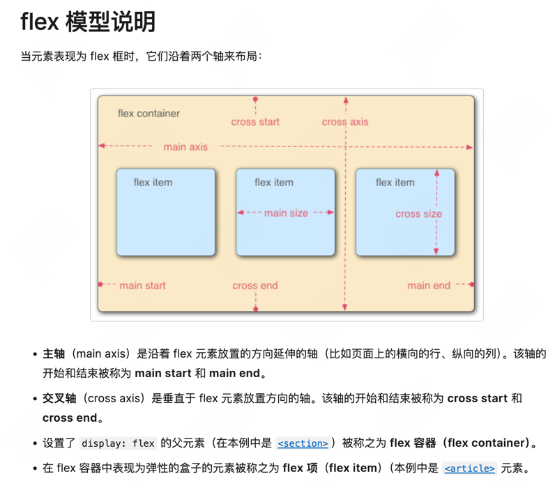

# ReactNative入门

# React的设计哲学
React Native 作为 React 的拓展，它遵循了 React 的核心设计哲学：
* 函数式编程
* 组件化拆分
* 单向数据流
* 声明式UI

# JSX语法

在React中，允许我们使用JSX语法来描述UI。JSX是JavaScript的语法扩展，它允许我们使用类似于HTML的语法来描述UI，即我们可以
在JavaScript脚本文件中编写HTML代码：

```javascript
import React from 'react';
const element = <h1>Hello, world!</h1>;
```

这本质上是一种语法糖，比如Android开发中的Compose，底层的实现上实际上还是操作DOM元素。

# TSX语法
不过，React Native中更推荐使用TSX语法来描述UI。TSX是TypeScript的语法扩展，它允许我们使用TypeScript来描述UI，即我们可以
在TypeScript文件中编写JSX代码。TypedScript是JavaScript的超集，它增加了类型检查的功能，相对而言更加安全。

# Flexbox布局
是CSS3中引入的一种布局方式，它允许我们使用CSS来定义布局。Flexbox布局可以让我们更加方便地实现响应式布局。
在React Native中是用Flexbox布局来定义布局的,初体验来说跟Android里的LinearLayout很像（真的很像），比如说他们都有布局方向，
也可以为每个子元素设置权重值。



**TIPS：** 当UI的效果不符合我们的预期的时候，尝试向外层找父布局使用的属性。使用RN提供的视图边界调试工具来看看父布局
的尺寸是否正常。

## width & height
首先最基本的就是元素的尺寸大小，即宽高了。这一点和CSS中的标准盒子模型一样，通过width和height元素我们可以设置
元素的`内容（即content）`区域的尺寸大小，除了可以设置成具体的尺寸，还可以设置成`auto`RN根据元素的内容自动计算尺寸，
还有百分比，设置的是按父元素尺寸为参照乘以百分比后得出来的尺寸。

## 定位
确定尺寸之后要决定的就是元素需要被摆放的位置，具体来说有三种定位的方式：
* relative：根据正常的布局流程，然后根据设置的{left,right,top,bottom}属性进行偏移，不过它不会影响别的元素；
* absolute：独立于正常的的布局流程，完全根据{left,right,top,bottom}属性进行布局；
* static：根据正常的流程布局，并且会无视{left,right,top,bottom}属性；

## Flex Direction
是Flexbox布局中的一个属性，它定义了子元素的排列方向。Flex Direction可以取以下值：
* row：子元素从左到右排列；
* row-reverse：子元素从右到左排列；
* column：子元素从上到下排列；
* column-reverse：子元素从下到上排列；
它的行为跟LinearLayout可以说是一致，在默认情况下，子元素是从上到下排列的，也就是column布局。

## Layout Direction
这是一个多语言适配相关的属性，总而言之有的地区的语言阅读习惯是从右到左的，所以他们的文字是从右到左排列的，
所以原本的布局方向就要发生改变。

语言的排列方式有两种，分别就是LTR和RTL,分别就是从左到右和从右到左排列。

## Justify Content
可以把这个属性和Android里的Gravity属性类比，Justify Content定义了子元素在主轴上的对齐方式。
* flex-start：子元素从主轴的开始位置开始排列；
* flex-end：子元素从主轴的结束位置开始排列；
* center：子元素在主轴上居中排列；
* space-between：子元素在主轴上均匀分布，子元素之间的间距相等；
* space-around：子元素在主轴上均匀分布，子元素之间的间距相等，子元素的两侧间距是子元素间距的一半。

## Align Items
Align Items定义了子元素在交叉轴（cross axis）上的对齐方式。所谓交叉轴就是和主轴垂直的轴。
当我们定义完主轴之后并且指定了排列方向后，实际上就指定了子元素在横轴或纵轴上上的排列方向。但是
子元素在交叉轴上的排列方式我们还没有指定，所以通过Align Items来指定子元素在交叉轴上的排列方式：
* flex-start：子元素从交叉轴的开始位置开始排列；
* flex-end：子元素从交叉轴的结束位置开始排列；
* center：子元素在交叉轴上居中排列；
* baseline：子元素按照基线对齐排列；
* stretch：子元素拉伸填充交叉轴（不能设置具体的固定尺寸，否则不生效）；

## Align Self
Align Self可以覆盖Align Items的属性，它定义了子元素的交叉轴上的排列方式。它的取值和效果
与Align Items完全一致，不同的是它是设置在子元素上(View)的，而Align Items是设置在父元素(ViewGroup)上的。

## Flex Wrap
Flex Wrap定义了当子元素超出了父元素的尺寸时是否换行显示。Flex Wrap可以取以下值：
* nowrap：子元素不换行显示；
* wrap：子元素换行显示；
* wrap-reverse：子元素反向换行显示；

## Align Content
Align Content定义了多行子元素在交叉轴上的排列方式，Align Content只能和Flex Wrap一起使用。
* flex-start：子元素从交叉轴的开始位置开始排列；
* flex-end：子元素从交叉轴的结束位置开始排列；
* center：子元素在交叉轴上居中排列；
* space-between：子元素在交叉轴上均匀分布，子元素之间的间距相等；
* space-around：子元素在交叉轴上均匀分布，子元素之间的间距相等，子元素的两侧间距是子元素间距的一半。

## Flex Basis
Flex Basis定义的是元素沿主轴方向上的默认大小，比如说如果主轴是横轴，那么Flex Basis就是元素的宽度；
如果主轴是纵轴，那么Flex Basis就是元素的高度。需要说明的是，Flex Basis设置的值是在 FlexGrow 和
FlexShrink 计算之前确定的。

## Flex Grow
Flex Grow决定的是如何给子元素们分配主轴上的剩余空间，当一个父元素布局完了子元素后可能会有剩余的空间，这时
就可以通过给子元素设置Flex Grow来决定如何分配剩余元素。他的分配方式是加权分配的，和flex属性，weight属性一致。

## Flex Shrink
描述了当所有子项总尺寸超过主轴上容器尺寸时，在溢出情况下如何收缩各个子项。如果将溢出尺寸视为负剩余空间，
则可以认为 flex shrink 和 flex grow 的工作方式非常相似。 这两个属性也能很好地配合使用，允许子项根据需要进行伸缩。
他的分配方式是加权分配的，和flex属性，weight属性一致。

## Gap
Gap属性决定的是子元素之间的间隙大小，类似于margin，具体可以分为水平方向，垂直方向以及同时指定两个方向的间隙。
* rowGap：子元素在主轴上的间隙；
* columnGap：子元素在交叉轴上的间隙；
* gap：同时指定两个方向的间隙；

# 组件
React中有两种组件，分为函数组件和类组件。函数组件是React 16.8 引入的一种新特性，它允许我们使用函数来定义组件，
而类组件则是React 16.8 之前使用的传统方式。

传统的类组件中存在生命周期的回调函数，总的来说它是有状态的组件，而函数组件则是无状态的组件，不过仍然可以
使用Hook函数来在函数组件中管理状态。

## 组件中的变量
目前来说，无论是函数组件还是类组件，他们都有两种类型，分别是状态变量和属性变量。所谓状态变量就是组件内部
的状态，而属性变量就是组件的外部传入的参数。我会用`是否具有记忆`这个特性来区分状态变量和属性变量，状态变量
具有记忆性，即当组件被重新渲染时，状态变量会被保留；而对于属性变量来说，每次组件被重新渲染时，属性变量
都会被重新赋值。

在我们的实际开发中，一般会把随着时间变化和用户输入可能变化的变量定义为状态变量，而把不变的变量定义为属性变量。
在类组件中用setState方法来更新状态变量，在函数组件中用useState方法来更新状态变量。

## 类组件
在React中的组件有两种类型，分别是类组件和函数组件。类组件更接近于客户端的开发方式，它提供了一种面向对象对象编程的方式，
并且提供了一些生命周期的回调；而函数组件更接近于前端的开发方式，我们需要结合一些Hook来保持/更改状态。
需要说明的是，目前官方更推崇函数式组件，并且像别的技术栈比如说Compose也越来越像函数式编程靠近了。

我们要定一个类组件的话需要继承ReactNative的Component类，必须重写`render`方法，返回组件所要展示的视图。
除此之外，最好定义一个构造函数`constructor(props)`，从这个props中接受参数来定义组件的一些私有状态`state`，
在TS中我们定义一个接口来使Props或者State更加清晰：
```typescript
interface MyViewState {
  name: string,
  age: number,
  [other: string]: any 
};
```
构造函数会在一开始被执行（组件被挂载之前）。一些注意事项：
* 不要在构造函数中执行一些副作用或者是订阅的操作，在`componentDidMount`方法中做这些事情；推荐的做法是只在构造函数中初始化组件
状态和进行方法的绑定。
* 我们始终需要在构造函数中先执行父类的构造方法，不然会导致状态错误。
* 构造函数是唯一一处可以直接设置state值的地方，别的地方都需要用setState来更改state属性。
* 在服务端渲染的情况下构造函数还会执行，但是别的生命周期的回调可能不会被执行。

和Android中的视图一样，类组件也有生命周期，它分为三个阶段：初始化阶段、运行阶段和销毁阶段。

在**组件创建阶段**又可以分为五步：
* getDefaultProps：初始化props属性的默认值；
* getInitialState：初始化组件的私有数据；
* `[已废弃]`componentWillMount：组件将要被挂载（但是还没有被渲染），这个阶段不能操作DOM元素但可以操作属性状态；
* render：第一次开始真正渲染DOM元素；
* componentDidMount：组件被挂载到页面之后，这个回调将会被执行；

接下来是**组件运行阶段**的步骤：
* `[已废弃]`componentWillReceiveProps：组件接收到新的属性时调用；
* shouldComponentUpdate：判断组件是否需要更新,一旦调用 setState，就会触发这个方法。
  方法默认 return true；如果 return false，后续的方法就不会走了；
* `[已废弃]`componentWillUpdate：组件将要更新；
* render：组件更新，更新完毕后页面上呈现出来的元素可能是旧的，但是内存中的DOM树已经是最新的；
* componentDidUpdate：组件更新完成，页面被重新渲染；
* componentDidCatch：组件抛出错误时调用；

最后是**组件销毁阶段**的步骤：
* componentWillUnmount：组件将要被卸载,一般做一些清理工作；

## 函数组件


# Hook函数
在 React 中，Hook（钩子函数）是 React 16.8 引入的一种新特性，它允许函数组件拥有类似类组件中的一些功能，如状态管理、生命周期方法等。
Hook 的出现大大简化了 React 代码的结构，使得函数组件变得更加灵活和强大。
## useState函数
useState函数是React中用于管理状态的一个函数，它返回一个数组，数组中包含两个元素：当前状态和更新状态的函数。这
乍一看和我们直接使用变量的方式没什么区别，但是useState函数会帮助我们进行状态管理，它确保状态更新后，UI 会自动反应到最新的状态。
而普通变量无法做到这一点，因此在需要动态交互和状态变化的场景中，应该始终使用 useState。

| 特性       | useState              | 普通变量            |
|----------|-----------------------|-----------------|
| 状态管理     | 管理组件的状态并保留其值          | 没有持久化，只会在渲染时初始化 |
| 触发组件更新   | 状态变化时触发组件重新渲染         | 不会触发组件重新渲染      |
| 状态持久化    | 会在不同的渲染周期之间保持最新的值     | 每次重新渲染时重置       |
| 用于动态数据渲染 | 是 React 推荐的做法，适用于动态数据 | 不适合动态变化的状态管理    |
| 性能优化     | React 会批量更新和优化渲染      | 不支持 React 的渲染优化 |

*注意⚠️：调用 set 函数 不会 改变已经执行的代码中当前的 state，它只影响 下一次 渲染中 useState 返回的内容。*

## 状态管理（重要）
从使用useState函数入门，其实我们就已经开始使用状态管理了。通常来说，*如果一个脚本中有变量，
那么每当这个脚本被重新执行时，这个变量都会重置为初始值，即它的状态值会丢失*。这显然是十分棘手的，
因为当数据发生改变的时候我们往往都需要更新UI，这个时候就会触发组件的重新渲染，即脚本的重新执行，
这就造成了一种矛盾：
```
变量状态改变 => 需要更新UI => 触发组件重新渲染 => 脚本重新执行 => 变量状态丢失
```
而且存在的另一个问题就是，当变量状态更新之后，UI 并不会自动更新，需要我们手动调用函数来更新UI，这个
时候状态的管理就更复杂了，当状态更新后，我们需要手动更新UI，这个过程中状态又会丢失，所以我们又不得不
在更新UI前保存状态，并且在下次脚本执行时恢复状态。

这里就有了钩子函数的概念，即useState函数就是一个钩子函数，它可以帮助我们管理状态，并且自动更新UI。
除了useState函数，React还提供了其他一些钩子函数，比如useEffect函数，它可以帮助我们管理副作用，比如
定时器、事件监听等。

## useRef函数
useState函数适用的是管理一些需要在屏幕上展示的信息，因为这些信息往往需要实时更新，而useRef函数则适用于
管理一些不需要在屏幕上展示的信息，比如DOM元素、计时器ID，与useState相比，useRef有以下特点：
* 可以在重新渲染之间 存储信息（普通对象存储的值每次渲染都会重置）。
* 改变它 不会触发重新渲染（状态变量会触发重新渲染）。
* 对于组件的每个副本而言，这些信息都是本地的（外部变量则是共享的）。

所以我们可以把useRef视作是一个组件内部的全局变量，它可以在组件的整个生命周期中保持不变，它仅在组件的第一次渲染时初始化一次，
当然我们后续也可以修改和获取这个变量的值。

## useEffect函数
useEffect函数是React中用于管理副作用的一个函数，它可以帮助我们管理一些需要在组件渲染完成后执行的代码，比如定时器、事件监听等。
所谓副作用，就是指和组件渲染无关的代码，比如定时器、事件监听等。

根据React官方文档，useEffect函数接受两个参数，分别是 `（setup, dependencies?）`，setup参数是一个函数，它的函数体内的代码将在
组件渲染完毕后（即组件函数调用完毕后）被执行，这个函数还可以返回一个函数，这个返回的函数将在组件卸载时被执行，总的来说就是一个清理函数。
dependencies参数是一个数组，它指定了setup函数所依赖的变量，如果这个数组中的变量发生变化，那么setup函数将被重新执行。

## 实战-自定义Hook函数
有了useRef函数和useEffect函数，我们可以实现一些自定义的功能，比如，我们可能想知道一些变量之前的状态是什么：
```javascript
function usePrevious(value) {
  const ref = useRef();
  useEffect(() => {
    ref.current = value;
  });
  return ref.current;
}
```
这是一个自定义的Hook函数，用来获取变量之前的值。它的原理是Ref对象的唯一性，它仅在组件第一次被渲染时进行一次初始化，而useEffect函数注册
的setup函数又只会在组件被渲染完毕后才执行（即它是在组件函数的最后才被执行的），所以usePrevious函数返回值的行为是先于更新Ref的值的，
所以usePrevious函数返回的值就是变量之前的状态了。


