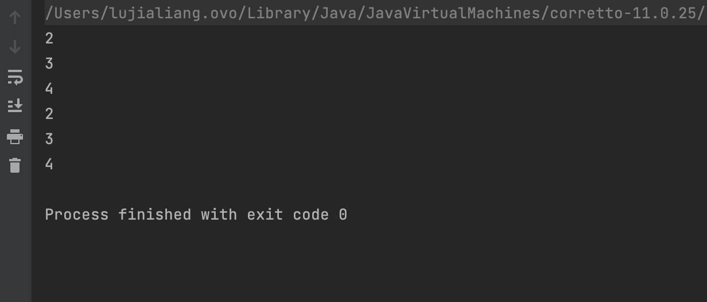
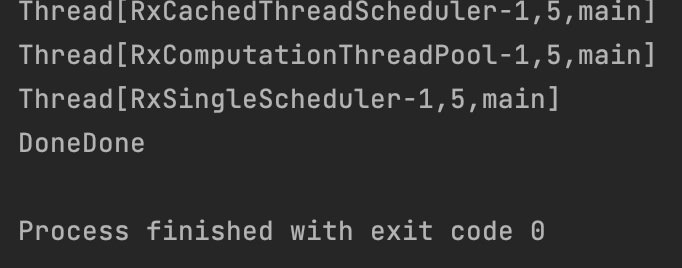

# RxJava 入门

## 基于观察者模型&责任链模式
RxJava的设计思路中很明显的亮点就是其对观察者/订阅者模型 ，以及责任链模式的使用，在该责任链中以数据为驱动，大致可以分为三种角色：   
* 生产者
* 消费者
* 处理器

整个**工作流程**大致如下：

```
发送数据        处理后向后传递         最终消费数据
[生产者]----------->[处理器]----------->[消费者]
```

其中，一个数据链路中可以有多个处理器，比如：
```
[生产者]---->[处理器1]---->[处理器2]---->[处理器3]---->[消费者]
```

我们以处理器2的视角来看，其左边的数据流部分称为 **数据上游** ，右半部分被称为 **数据下游**。

了解数据上下游对我们使用RxJava也是有很大帮助的，因为我们实际上可以指定数据上下游的执行线程，可以通过一些代码来验证。

## 时机
在RxJava中的官方文档中，有提到几个关键的时机，将RxJava的运行拆解成了三个步骤：
1. 组装时机：准备数据流的时机，这个过程还包括各种对发射源的操作符。
2. 订阅时机：对准备好的数据流进行订阅。
3. 运行时机：数据源实际开始发送数据的过程。

## 基础数据源的种类
RxJava中有几个基本的组件（流）：   
> RxJava 3 features several base classes you can discover operators on:
io.reactivex.rxjava3.core.Flowable: 0..N flows, supporting Reactive-Streams and backpressure
io.reactivex.rxjava3.core.Observable: 0..N flows, no backpressure,
io.reactivex.rxjava3.core.Single: a flow of exactly 1 item or an error,
io.reactivex.rxjava3.core.Completable: a flow without items but only a completion or error signal  
io.reactivex.rxjava3.core.Maybe: a flow with no items, exactly one item or an error.

大概有以下五种:     
* Flowable
* Observable
* Single
* Completable
* Maybe

每个组件都有自身的职责：  
1. Flowable：flowable 是一个发送数据的源，支持响应式的流和背压，至于什么是背压，后面会提到。
2. Observable
Observable 和 flowable 类似，是一个数据的发送源，不同的是它不支持背压策略。
3. Single
Single 是只支持一个数据发送的数据源。
4. Completable
Completable 是一个不携带数据的流，我们一般用来传递信号。
5. Maybe
Maybe 可能不携带数据，也可能携带一个数据或者是错误。

## 创建数据源
这里介绍一个通用的创建数据源的方法，即直接使用 XXXX.create() 方法，比如如果我们想要创建一个Observable，可以用以下的方式：
```java
Observable.create(emitter -> {
    for (int i = 0;i < 5;i++) {
        emitter.onNext(i);
    }
});
```
这是一种最通用的方式，理论上这种方式可以创建所有我们需要的数据源。除此之外还有一些预制的手段：

* 使用Observable.fromIterable()方法，可以将一个List转化为Observable。
* 使用Observable.just()，用于创建一个简单的数据源，直接发射一个或多个指定的数据项。
* Observable.interval()，用于创建一个周期性发射的 Observable，它按照指定的时间间隔定期发射数据。
* Observable.timer()， 用于延迟一定时间后发射一个单一的值。

## 基础使用
基本的使用流程可以参照那三个时机，即先组装，后订阅，整个过程类似于 Kotlin 中的协程 + LiveData，据说 Kotlin 中的Flow API 也可以实现这种效果（todo）。

我们首先先组装数据源：
```java
//创建简单的数据源
Observable<Integer> source = Observable.just(1,2,3);
//组装数据流--简单处理+1
Observable<Integer> chain = source.map( data -> {return data + 1;});
```
这里我们创建了一个简单的数据源，然后给其组装上了一个简单的操作符。
Í
然后我们订阅这个数据源即可，对于Observe来说，整个订阅事件是粘性的（冷流），即数据的发送是在订阅者订阅之后才发生的，且每个不同的订阅者都会从头到尾收到完整的数据序列：
```java
public static void main(String[] args) {
    //创建简单的数据源
    Observable<Integer> source = Observable.just(1,2,3);
    //组装数据流--简单处理+1
    Observable<Integer> chain = source.map( data -> {return data + 1;});
    //订阅数据源
    chain.subscribe(System.out::println);
    chain.subscribe(System.out::println);
}
```
比如这里我们连续订阅了两次相同的数据源，就会打印两次序列：


## 线程的调度
RxJava中提供的另一个强大的功能就是其提供线程的切换操作（与Kotlin中的协程类似），即我们可以在整个数据链路的处理中灵活地切换每个操作所在的线程，这对移动端开发是非常实用的，因为移动端开发（Android）中不允许在主线程中执行耗时的操作，不然很容易出现ANR，而对UI的修改又必须处在主线程中。使用RxJava就可以很好地覆盖这种场景，我们可以先将IO操作切到其余线程中去执行，等到数据返回后再切换回主线程中去更新UI。

### 线程调度器

RxJava中默认提供了五种调度器：    
* Schedulers.io()：用于 I/O 操作（例如网络请求、文件操作等）。它会使用一个大小可动态调整的线程池。适用于不需要长时间运行的任务。  
  * 特性：它会重用空闲的线程，并且线程池大小是动态的，因此可以高效地处理 I/O 密集型的任务。
  * 典型用法：网络请求、磁盘读写等 I/O 密集型操作。
  
* Schedulers.computation()：用于计算密集型任务。它的线程池大小通常是 CPU 核心数，用于执行计算密集型的任务（如数学计算、大数据处理等）。
  * 特性：使用的线程池大小通常与 CPU 核心数相等，适合执行计算密集型的操作。线程池大小是固定的。
  * 典型用法：进行复杂计算、数据处理等。

* Schedulers.newThread()：每次调度任务都会创建一个新的线程。它不重用线程池中的线程，每次都创建一个新线程来执行任务。
  * 特性：适合需要完全隔离执行环境的任务，但由于每次都创建新线程，因此可能带来较高的性能开销。
  * 典型用法：任务需要完全隔离，且不介意多次创建新线程时。

* Schedulers.single()：用于串行执行任务，所有的任务都会在同一个线程中顺序执行。该线程池只有一个线程，所以多个任务是串行执行的。
  * 特性：适用于你希望所有任务按顺序在单个线程中执行的场景。通常用于避免并发和线程安全问题。
  * 典型用法：顺序执行的任务，例如任务调度或某些单线程任务。

* Schedulers.trampoline()：所有的任务都将在当前线程中顺序执行，直到当前线程的工作完全完成。它是一个特殊的调度器，会将任务排队并在当前线程的空闲时执行。
  * 特性：适用于当你希望顺序执行任务并且不想切换线程时。
  * 典型用法：任务调度和处理，适合确保任务按顺序执行。

针对Android平台，RxJava还特别提供了一个主线程调度器：**AndroidSchedulers.mainThread()**

### 线程切换实操
RxJava中的线程切换主要是用两个方法：
* subscribeOn(): 用于指定 数据源（observable、flowable等）执行的线程。也就是说，它控制 Observable 或者 Flowable 开始发射数据的位置。 **只有第一次** 触发数据源的订阅时，它才会作用于整个数据流。
* observeOn(): 用来指定 后续操作的线程。即它控制 观察者（subscriber） 或者 操作符（如 map、filter 等）执行的线程。

这里我们模拟一下：
```java
public class hello {
    volatile static boolean shouldShutdown = false;
    public static void main(String[] args) {
        //组装数据源
        Flowable.fromCallable( () -> {
            ThreadUtil.INSTANCE.printlnCurrentThread();
            Thread.sleep(500);
            return "Done";}
                )
                //指定数据源的运行线程
                .subscribeOn(Schedulers.io())
                //切换后续的调度线程
                .observeOn(Schedulers.computation())
                .map( string -> {
                     ThreadUtil.INSTANCE.printlnCurrentThread();
                     return string + string;
                    }
                )
                //切换后续的调度线程
                .observeOn(Schedulers.single())
                .subscribe(string -> {
                    ThreadUtil.INSTANCE.printlnCurrentThread();
                    System.out.println(string);
                    shouldShutdown = true;
                });

        while (!shouldShutdown) ;
    }
}
```
最后的运行结果是：
