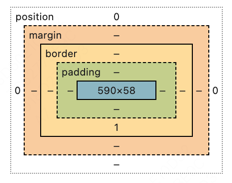
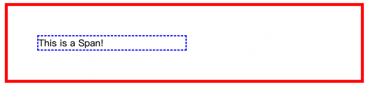

# HTML CSS入门

# 基础的Html标签
一个最基础的HTML标签如下表示:
```html
<!doctype html>
<html lang="zh-CN">
  <head>
    <meta charset="utf-8" />
    <title>我的测试站点</title>
  </head>
  <body>
    <p>这是我的页面</p>
  </body>
</html>
```
其中，`<!doctype html>`是一个声明，表示这是一个html文档，这是一个历史遗留问题，我们声明了就行。   
接着是`html标签`，其代表着页面的根目录，html标签中又包含两个最基本的子标签：`head`标签和`body`标签
其中`<head>`标签代表存在于页面中但不展示出来的东西，比如：你想在搜索结果中出现的关键字和页面描述、CSS 样式、字符集声明等等。
相对的，`<body>`标签代表将会在页面上显示的内容。接下来是`<meta>`标签，这个元素代表了不能由其他 HTML 元相关元素表示的元数据，
比如 `<base>、<link>、<script>、<style> 或 <title>`。charset 属性将你的文档的字符集设置为 UTF-8，其中包括绝大多数人类书
面语言的大多数字符。

# 基本标签

## Heading（标题）
一般用来指定每一章节的标题，用`<h>`标签来显示，html支持六级标题，所以最多可以从`<h1>`到`<h6>`。

## Paragraph（段落）
用`<p>`标签来指定段落。

## Span（普通文本）
我们可以使用`<span>`标签来指定普通文本，span标签没有语义，只是单纯地用来包裹文本并且默认不会产生换行。

## br（换行符）
上面提到了Span标签默认不会换行，这是我们就可以通过使用br标签来手动换行。

## 列表和列表项
列表可以分为有序列表（ordered list）和无序列表（unordered list）,显而易见，前者是有序的，后者是无序的。

可以通过缩写来记忆，`<ol>`标签是有序列表，而`<ul>`标签是无序列表。至于列表里的列表项，我们用`<li>` 即`list ltem`来指定。
代码产生的效果如下：
```
<ol>
    <li>item1</li>
    <li>item2</li>
</ol>
<ul>
    <li>item1</li>
    <li>item2</li>
</ul>
```
具体效果：
<ol>
    <li>item1</li>
    <li>item2</li>
</ol>
<ul>
    <li>item1</li>
    <li>item2</li>
</ul>

## Anchor（锚点）
通过锚点标签，我们可以实现一些跳转的功能：
```html
<a href="https://www.mozilla.org/zh-CN/about/manifesto/">FireFox</a>
```
该代码实现的效果就是：
<a href="https://www.mozilla.org/zh-CN/about/manifesto/">FireFox</a>

# css样式表
在html中，我们可以通过css样式表来指定页面的样式，通常在head标签中指定：
```html
<link rel="stylesheet" href="style.css" />
```
这样就可以加载一个css样式表了

# 选择器
选择器是css样式表的核心部分，它决定了样式表中的样式会作用到哪些元素上。最简单的，我们可以选择一个
类别的标签：
```css
p {
    color: red;
}
```
这段代码的意思就是选择了p标签，然后将花括号内的样式应用到p标签上。

除此之外，我们还可以选择类名，具体来说，我们可以在html中为标签指定一个类名：
```html
<p class="red">这是一个段落</p>
```
然后我们就可以在css中选择这个类:
```css
.red {
    color: red;
}
```
使用.号，我们可以指定类名。                 
我们还可以混合使用这两种方式，即同时指定标签名和类名，这样只有当同时符合标签名和类名时，样式才会生效：
```css
p.red {
    color: red;
}
```

在这里总结一下选择器的种类：
1. 标签选择器：选定某一个标签
2. 类选择器：选定某一个类
3. ID选择器：选定某一个ID
4. 标签属性选择器：选定拥有某个属性的标签
5. 伪类和伪元素选择器：选定某个状态下的标签或者某个标签的某个部分
6. 关系选择器：选定某个标签的子标签或者父标签

# 盒子模型

在css中，一般有两种类型的盒子：块级盒子（block box）和行内盒子（inline box）。类型指的是盒子在页面流中的行为方式以及与页面上
其他盒子的关系。 

CSS盒子模型就是用一个矩形模型来描述页面中元素的各个部分，就如同在Android里一样，有content内容区域，padding内边距，border边框，margin外边距。
我们可以在浏览器的调试模式里看到这些区域：   


## 外边距折叠
当我们设置盒子的margin属性时，会发生外边距折叠的情况，具体来说，若两个盒子相邻且他们都设置了margin属性，那么这两个盒子的margin
会合并为一个margin，具体合并的规则要看两者的符号关系，即若两个盒子的margin符号相同（都为正数或者负数），那么margin会合并成绝对值
较大者；若两个盒子的margin符号相反（一个正数一个负数），那么margin会合并成两者的和。

## 标准的CSS盒子模型 和 替代盒子模型
在标准盒模型中，如果在盒子上设置了width和height属性，那么width和height属性只指定了content区域的宽和高,整个盒子的大小除了
content区域的大小外还要加上padding和border的大小（不算margin，感觉和Android里一致，margin是给父布局使用的）。

而在替代盒模型中，width和height属性指定了整个盒子的大小，包括content区域、padding区域和border区域，要对某个元素使用替代盒模型，
只需要在css中设置box-sizing属性为border-box即可：
```css
.box {
    box-sizing: border-box;
}
```

## 显示类型
显示类型决定了元素在其父元素中的表现方式,从大类上来说可以分为block盒子和inline盒子。 

一个拥有 block 外部显示类型的盒子会表现出以下行为：
* 盒子会产生换行。
* width 和 height 属性可以发挥作用。
* 内边距、外边距和边框会将其他元素从当前盒子周围“推开”。
* 如果未指定 width，方框将沿行向扩展，以填充其容器中的可用空间。在大多数情况下，盒子会变得与其容器一样宽，占据可用空间的 100%。
某些 HTML 元素，如 `<h1> 和 <p>`，默认使用 block 作为外部显示类型。

一个拥有 inline 外部显示类型的盒子会表现出以下行为：

* 盒子不会产生换行。
* width 和 height 属性将不起作用。
* 垂直方向的内边距、外边距以及边框会被应用但是不会把其他处于 inline 状态的盒子推开。
* 水平方向的内边距、外边距以及边框会被应用且会把其他处于 inline 状态的盒子推开。
某些 HTML 元素，如 `<a>、 <span>、 <em> 以及 <strong>`，默认使用 inline 作为外部显示类型。

## display属性
我们具体可以通过display属性来指定盒子的类型：
* block:
  * 元素显示为块级元素。
  * 每个块级元素占据一整行，宽度默认填满父容器。
  * 例如：`<div>, <p>, <h1>` 等。
* inline:
  * 元素显示为行内元素。
  * 行内元素不会换行，只占据自身内容的宽度。
  * 例如：`<span>, <a>, <strong>` 等。
* inline-block:
  * 元素显示为行内块级元素。
  * 既具有块级元素的特性（可以设置宽高），又具有行内元素的特性（不会换行）。
  * 例如：`, <button> `等。
* none:
  * 元素不显示，并且不占据任何空间。
  * 例如：可以用于隐藏元素。
* flex:
  * 元素显示为弹性盒子容器。
  * 子元素按弹性盒模型排列。
  * 例如：用于创建响应式布局。
* grid:
  * 元素显示为网格容器。
  * 子元素按网格模型排列。
  * 例如：用于创建复杂的网格布局。
* table:
  * 元素显示为表格。
  * 例如：`<table>` 元素。
* table-row:
  * 元素显示为表格行。
  * 例如：`<tr>` 元素。
* table-cell:
  * 元素显示为表格单元格。
  * 例如：`<td>` 元素。
* list-item:
  * 元素显示为列表项。
  * 例如：`<li>` 元素。

# 冲突规则
在css中，冲突规则是指当多个样式同时作用于同一个元素时，浏览器需要决定如何应用这些样式。在默认情况下，如果多个样式同时作用于了一个标签，
且样式没有优先级，那么在css文件中最后写的样式将会生效。

## 冲突优先级
上面提到的是默认情况下的决策，即没有优先级关系的情况下，但实际上样式表中的样式也是有优先级的概念的。
这里需要提到的是，优先级高的样式表并不会完全覆盖低优先级的样式表，而是*只会覆盖低优先级样式表中的相同属性*。      

可以遵循一个原则：越详细的选择器优先级越高。这里的详细的意思是选择器选中的标签越具体（表现出来就是选择的标签，id或者类更多），
那么它的优先级就更高。一个选择器的权重值可以认为是一个三位数，由标签类，类和id加权相加组成。其中，标签的权重值1，类的权重值10，
id的权重值100。比如，一个选择器为div#id.class，那么它的权重值为1+10+100=111，以此类推。       

权重值越高，那么它的作用效果也是越优先的。      
## 內联样式
内联样式是指将样式直接写在标签上的一种样式方式，它的优先级总是最高的。

## 继承
继承指的是一些设置在父元素上的样式在子元素上也会生效。比如说字体大小、字体颜色等属性，而像宽高等属性是不会被继承的。
比如:
```html
<span style="color: #bd2130">
    <span>这是一个段落</span>
</span>
```
显示效果：
<span style="color: #bd2130">
    <span>这是一个段落</span>
</span>

虽然内层的span标签并没有设置颜色，但是由于外层设置了颜色，所以内层的span标签也会继承外层的颜色。

## 控制继承
Css中还为控制继承提供了五个特殊的通用属性：
1. inherit：设置该属性会使子元素属性和父元素相同。实际上，就是“开启继承”。
2. initial：将应用于选定元素的属性值设置为该属性的初始值。
3. revert：将应用于选定元素的属性值重置为浏览器的默认样式，而不是应用于该属性的默认值。在许多情况下，此值的作用类似于 unset。
4. revert-layer：将应用于选定元素的属性值重置为在上一个层叠层中建立的值。
5. unset：将属性重置为自然值，也就是如果属性是自然继承那么就是 inherit，否则和 initial 一样。

除此之外，我们还可以使用all属性来控制属性 all 可以用于同时将这些继承值中的一个应用于（几乎）所有属性。
它的值可以是其中任意一个（inherit、initial、unset 或 revert）。这是一种撤销对样式所做更改的简便方法，以便回到之前已知的起点。
比如有下面一段HTML:
```html
<blockquote>
    <p>当前块引用设置了样式</p>
</blockquote>

<blockquote class="fix-this">
    <p>当前块引用未设置样式</p>
</blockquote>
```
我们设置了样式表:
```css
blockquote {
  background-color: orange;
  border: 2px solid blue;
}
```
此时这两段块引用都会应用这段css样式，如果我们想要重置第二段块引用的样式，就可以使用all属性：
```css
blockquote {
  background-color: orange;
  border: 2px solid blue;
}

.fix-this {
  all: unset;
}
```
此时我们就会将第二段块引用的样式重置为默认样式。

# CSS中的值和单位

## 绝对长度单位
css中常见的单位有长度，可以分为绝对长度单位和相对长度单位，绝对长度单位与其他任何东西都没有关系，通常被认为是总是相同的大小。
具体单位有：
* cm：厘米
* mm：毫米
* in：英寸
* pt：点
* pc：派卡
* px：像素
一般比较常用的就是px。

## 相对长度单位
相对长度单位是和绝对长度单位相比的，它会根据其他元素的大小来设置自己的大小。比如说`em`单位，它会根据当前元素的字体大小来设置自己的大小。
具体单位有：
* em：相对于当前元素的字体大小
* rem：相对于根元素的字体大小
* vw：相对于视口宽度
* vh：相对于视口高度
* vmin：相对于视口高度和宽度中较小的一个
* vmax：相对于视口高度和宽度中较大的一个

## 百分比单位
百分比单位跟相对单位类似，比如说如果将元素的字体大小设置为百分比，那么它将是元素父元素字体大小的百分比。如果使用百分比作为宽度值
，那么它将是父值宽度的百分比。比如:
```html
<body>
    <div class="container" style="border: 5px solid red;width: 500px;display: block;padding: 50px">
        <span style="width: 50%;border: 2px dashed blue;display: block">This is a Span!</span>
    </div>
</body>
```
这里内部的span元素的宽度就是父元素的50%了：         


## 数字
除此之外，还有一些属性接受数字（不添加任何单位），比如说不透明度属性opacity它本质上就是一个百分比值。0表示完全透明，1表示完全不透明。

## 颜色
颜色的取值一般来说有四种方法：
1. 使用系统中预设的颜色名称，比如red、blue等。
2. 使用十六进制值，比如#FF0000表示红色。
3. 使用RGBA值，比如rgb(255,0,0)表示红色，我们还可以使用rgba函数来设置一个透明度。
4. HSL和HSLA值。

## 函数
是css中的一种特殊值，它允许我们执行一些操作并返回一个值。比如说我们可以通过函数来计算宽度，设置渐变背景颜色。
```css
background-image: linear-gradient(
        90deg,
        rgb(119 0 255 / 39%),
        rgb(0 212 255 / 100%)
);
```
比如上面的代码就给一个元素设置了一个渐变颜色背景，除此之外我们还可以动态计算宽度：
```css
width: calc(100% - 20px);
```


